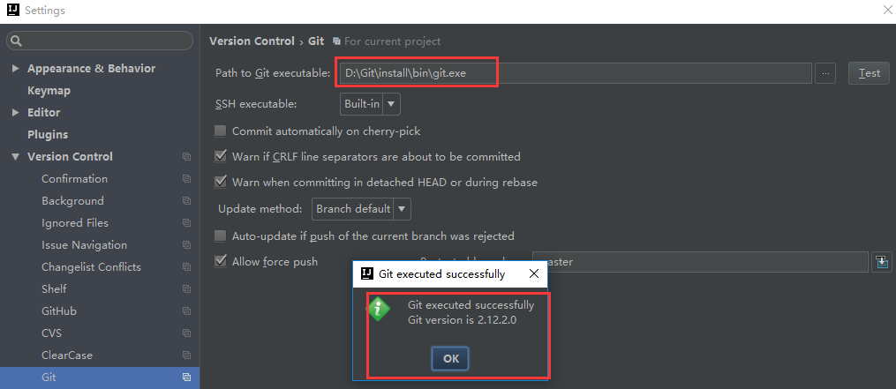
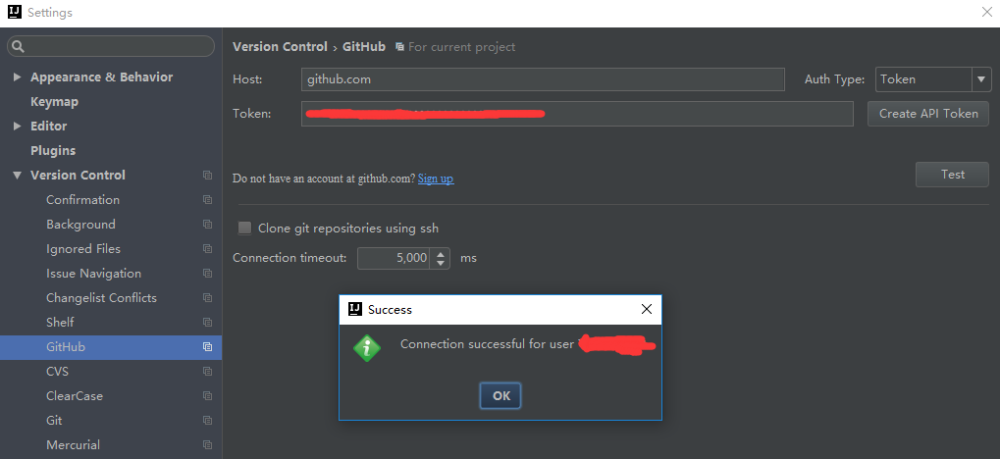
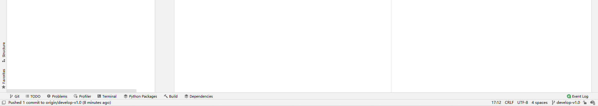
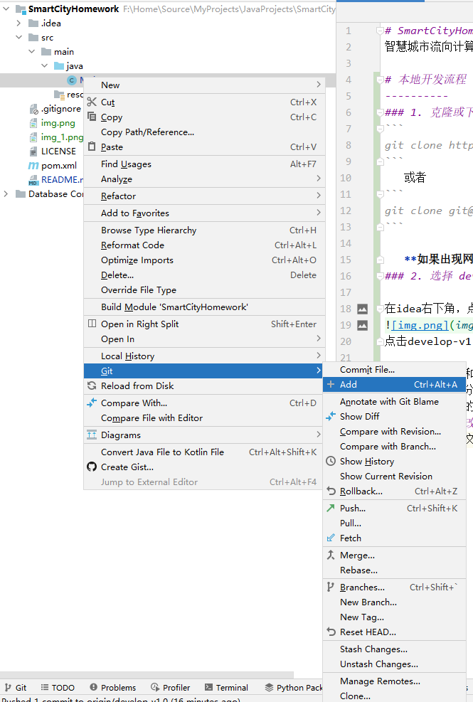
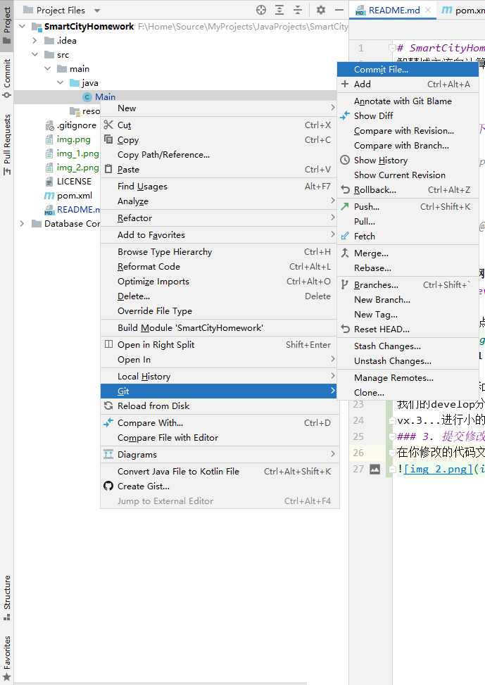
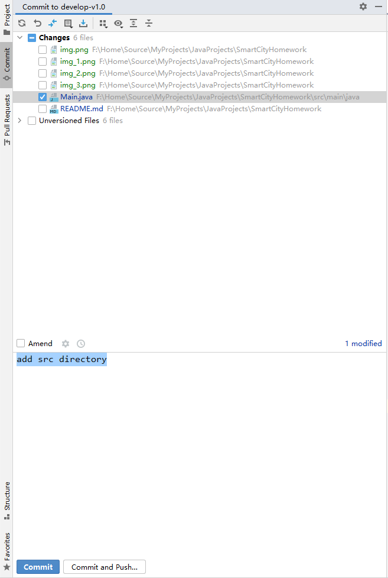

# SmartCityHomework
智慧城市流向计算大作业

# 本地开发流程
----------

### 1. 将IDEA 连接到Github
1. 在github中创建一个账号：https://github.com/join?source=header-home

2. 下载并安装git：https://git-scm.com/downloads

3. 安装成功后打开Git Bash，输入下列命令，设置git全局用户名和邮箱
```
$ git config --global user.name "Your Name"

$ git config --global user.email email@example.com
```
4. 在IDEA中设置Git，在File-->Setting->Version Control-->Git-->Path to Git executable选择你的git安装后的git.exe文件，然后点击Test，测试是否设置成功
   
   要是在bin目录下没找到此exe，不妨看看cmd目录下面有没有，也就是c://~install/cmd/git.exe;

5.在IDEA中设置GitHub，File-->Setting->Version Control-->GibHub

Host：github.com

Token：点击Create API Token，输入在github中注册的用户名和密码生成token

点击Test，测试是否连接成功


### 2. 克隆或下载仓库
```
git clone https://github.com/xls111/SmartCityHomework.git 
```
   或者
```
git clone git@github.com:xls111/SmartCityHomework.git
```

   **如果出现网络问题  直接下载压缩包**


### 3. 选择 develop-v1.0 分支

在idea右下角，点击图标处的分支名称

点击develop-v1.0 分支，在弹出的选项框里点击checkout，切换分支。

之后所有的修改和添加代码在develop-v1.0分支进行，当代码能够完整地运行后在合并到主分支中。
我们的develop分支可以有多个版本，每个大版本v1,v2,v3...添加大的功能，每个小的版本vx.1,vx.2,
vx.3...进行小的改动和修改
### 4. 提交修改的代码
在你修改的代码文件右键，按下图所示，选择Add 添加到git的暂存区（缓存区）中



之后再右键，选择Commit File 提交上一步添加到暂存区的代码文件，


Git 每次提交一次文件，都要写相应的提交信息（comment），在左下框简单而清晰地写出此处提交的内容后，
点击Commit and Push按钮将修改后的代码提交到Github上。



刷新Github页面，可以看到代码已经被修改了